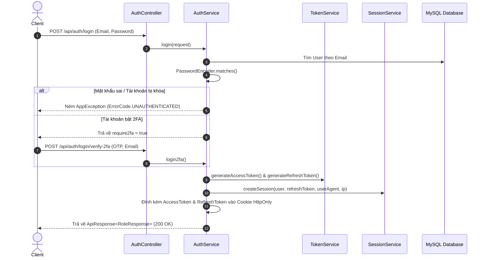
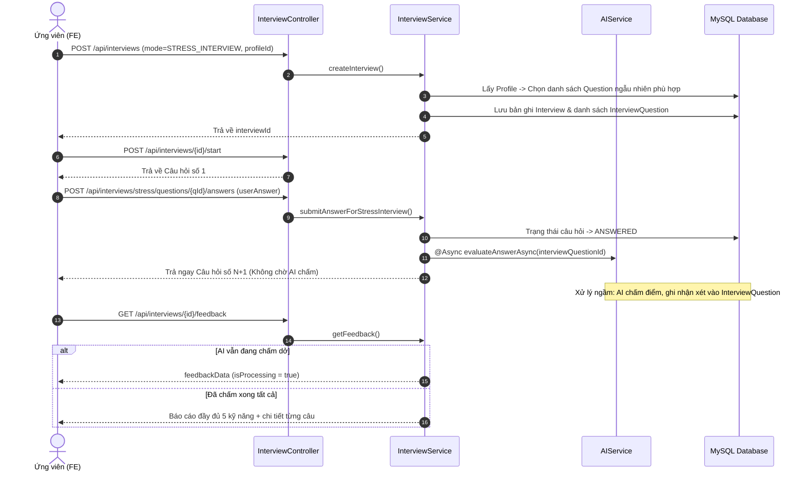
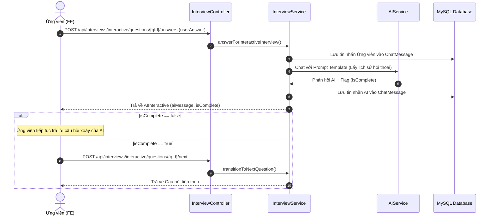
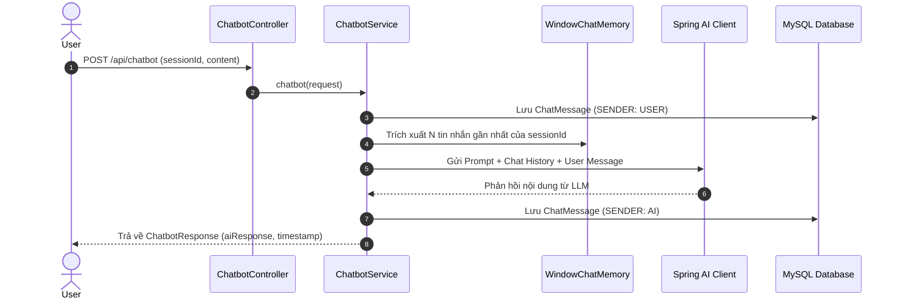
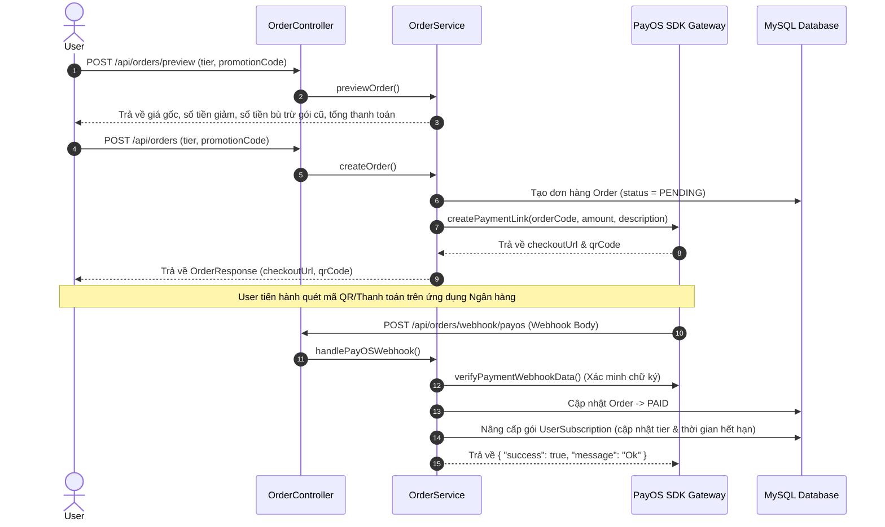
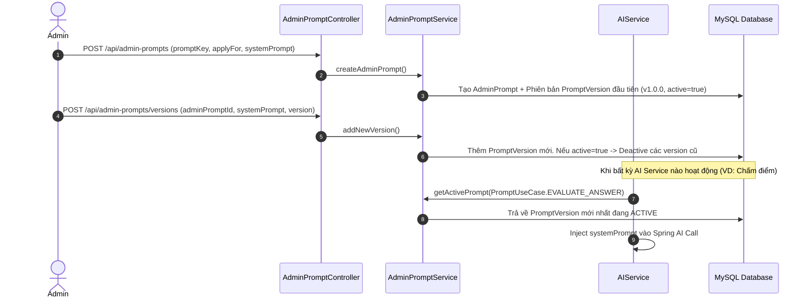

# TỔNG HỢP VÀ CHI TIẾT CÁC LUỒNG CHỨC NĂNG HỆ THỐNG (IT-IAP BACKEND)

Dự án **IT-IAP (IT Interview Assistance Platform)** là hệ thống Backend xây dựng trên nền tảng **Java 21** và **Spring Boot**, hỗ trợ ứng viên công nghệ thông tin luyện phỏng vấn việc làm bằng AI. Hệ thống tích hợp các công nghệ hiện đại như Spring Security, Spring AI, OAuth2 Google, 2FA TOTP, Redis Caching, Cloudinary và PayOS.

---

## PHẦN 1: TỔNG HỢP CÁC LUỒNG CHỨC NĂNG CHÍNH HỆ THỐNG

### 1. Luồng Xác thực, Phân quyền & Quản lý Phiên (Authentication & Security)
- **Đăng ký / Đăng nhập**: Xác thực qua Email & Mật khẩu (mã hóa BCrypt). Cấp phát JWT Access Token và Refresh Token lưu an toàn trong Cookie `HttpOnly`.
- **Đăng nhập Google OAuth2**: Tự động đồng bộ tài khoản Google qua OAuth2, tạo mới hoặc liên kết tài khoản hệ thống.
- **Xác thực 2 yếu tố (2FA TOTP)**: Sử dụng Google Authenticator / ứng dụng 2FA. Luồng hủy 2FA có đếm ngược an toàn 24h để phòng ngừa chiếm đoạt tài khoản.
- **Quản lý phiên đa thiết bị (User Session)**: Theo dõi thiết bị đang đăng nhập thông qua `sid` (Session ID). Cho phép người dùng đăng xuất từng thiết bị riêng lẻ hoặc đăng xuất tất cả các thiết bị khác.

### 2. Luồng Phỏng vấn Áo bằng AI (AI Mock Interview Engine)
Hỗ trợ 2 chế độ phỏng vấn chính dựa trên tiêu chuẩn câu hỏi theo vị trí (`TargetPosition`) và cấp độ (`TargetLevel`):
- **Chế độ Phỏng vấn Áp lực (STRESS_INTERVIEW)**:
  - Ứng viên trả lời tuần tự danh sách câu hỏi.
  - Sau khi gửi câu trả lời, hệ thống bắn sự kiện xử lý bất đồng bộ (`@Async`) để AI chấm điểm ngầm, đồng thời trả ngay câu hỏi tiếp theo cho ứng viên mà không cần chờ đợi.
  - Khi hoàn thành, người dùng xem báo cáo đánh giá (Feedback) chi tiết cho từng câu và nhận xét tổng quan 5 nhóm kỹ năng.
- **Chế độ Phỏng vấn Tương tác (INTERACTIVE_INTERVIEW)**:
  - AI đóng vai người phỏng vấn trực tiếp (Chatbot phỏng vấn).
  - Ứng viên gửi câu trả lời, AI tiếp tục hỏi vặn/hỏi sâu (Follow-up) dựa trên ngữ cảnh hội thoại (`ChatMessage`).
  - Khi AI xác định câu trả lời đã đạt yêu cầu (`isComplete = true`), hệ thống mới cho phép chuyển sang câu hỏi tiếp theo.

### 3. Luồng Ngân hàng Câu hỏi & Sinh Câu hỏi Tự động (Question Bank & AI Generation)
- **Ngân hàng câu hỏi**: Lưu trữ các câu hỏi phân loại theo Vị trí (Backend, Frontend, Tester, Data Analyst), Cấp độ (Intern, Fresher), và Phân loại (Technical, Situational, Behavioral).
- **Sinh câu hỏi tự động**: Admin kích hoạt tính năng sinh câu hỏi tự động qua Spring AI. AI tự động sinh câu hỏi chuẩn theo tham số yêu cầu và lưu vào database với nguồn gốc `AI`.

### 4. Luồng Trợ lý Chatbot AI (AI Chatbot Advisor)
- **Quản lý phiên chat (`ChatSession`)**: Người dùng tạo các phiên hội thoại để tư vấn sửa CV, hỏi đáp kiến thức lập trình, kinh nghiệm phỏng vấn.
- **Bộ nhớ ngữ cảnh (`WindowChatMemory`)**: Lưu giữ lịch sử tin nhắn gần nhất để AI hiểu ngữ cảnh trao đổi liên tục mà không vượt quá giới hạn token.

### 5. Luồng Diễn đàn & Tương tác Cộng đồng (Community Forum & Gamification)
- **Bài đăng tự động & Cá nhân**: Cho phép người dùng chia sẻ chuỗi ngày học tập (`Streak`) hoặc bảng điểm/kết quả học tập (`GPA`) lên diễn đàn công khai.
- **Tương tác**: Thả cảm xúc (`LOVE`, `HAHA`, `WOW`), tùy chỉnh chế độ ẩn/hội thoại bài viết (`visible`).
- **Bảng xếp hạng (Streak Leaderboard)**: Vinh danh TOP 10 thành viên có chuỗi luyện tập liên tục cao nhất.

### 6. Luồng Gói Dịch vụ & Thanh toán trực tuyến (Subscription & PayOS Integration)
- **Xem trước đơn hàng (`Preview Order`)**: Tính toán chính xác giá tiền sau khi áp dụng mã giảm giá (`Promotion`) và trừ bù số tiền của gói cước cũ.
- **Tạo đơn hàng & Nâng cấp gói (`AccountTier`)**: Tích hợp cổng thanh toán PayOS tạo mã QR/Link thanh toán.
- **Tự động xử lý Webhook**: Nhận callback từ PayOS, tự động xác thực chữ ký bảo mật, chuyển trạng thái đơn hàng thành `PAID` và nâng cấp tài khoản (FREE -> PRO/VIP).

### 7. Luồng Thông báo & Tác vụ Định kỳ (Notifications & Schedulers)
- **Thông báo đa kênh**: Gửi thông báo hệ thống, duyệt bài, thanh toán hoặc thông báo toàn hệ thống từ Admin.
- **Tác vụ Cron Job tự động**:
  - `InterviewScheduler`: Tự động hủy/đóng các buổi phỏng vấn quá hạn hoặc bị bỏ dở.
  - `TwoFactorScheduler`: Dọn dẹp các yêu cầu gỡ 2FA đã hết hạn đếm ngược 24h.
  - `NotificationScheduler`: Xóa các thông báo cũ hết hạn lưu trữ.

### 8. Luồng Bảng điều khiển & Quản trị (Analytics & Admin Management)
- **User Dashboard**: Thống kê số buổi phỏng vấn đã hoàn thành, radar chart 5 kỹ năng, số ngày streak hiện tại.
- **Admin Dashboard**: Biểu đồ phân bổ vị trí phỏng vấn, thống kê doanh thu, tổng số lượng người dùng mới, và nhật ký thao tác quản trị (`AdminActivityLog`).
- **Quản lý Prompt AI (`AdminPrompt` & `PromptVersion`)**: Cho phép Admin tùy chỉnh nội dung Prompt hệ thống, đánh số phiên bản (Versioning) và kích hoạt phiên bản phù hợp cho từng mục đích sử dụng (Chấm điểm, sinh câu hỏi, chatbot).

---

## PHẦN 2: CHI TIẾT NGUYÊN LÝ HOẠT ĐỘNG & LUỒNG CỦA TỪNG MODULE THEO CODEBASE

---

### Module 1: Auth & Security (`com.example.it_iap.controller.AuthController`, `TotpController`, `SessionController`)

#### 1. Thành phần Codebase liên quan
- **Controllers**:
  - [AuthController.java](file:///d:/DoAnTotNghiep/ITIAP/it-iap-be/src/main/java/com/example/it_iap/controller/AuthController.java)
  - [TotpController.java](file:///d:/DoAnTotNghiep/ITIAP/it-iap-be/src/main/java/com/example/it_iap/controller/TotpController.java)
  - [SessionController.java](file:///d:/DoAnTotNghiep/ITIAP/it-iap-be/src/main/java/com/example/it_iap/controller/SessionController.java)
- **Services**: `AuthService`, `TokenService`, `SessionService`, `VerificationService`, `CookieService`, `CustomOAuth2UserService`, `CustomSuccessHandler`
- **Entities**: `User`, `UserOauth2Account`, `UserSession`
- **Config**: [SecurityConfig.java](file:///d:/DoAnTotNghiep/ITIAP/it-iap-be/src/main/java/com/example/it_iap/config/SecurityConfig.java)

#### 2. Quy trình Thực thi Chi tiết

#### 3. Mô tả Luồng Xử lý
1. **Đăng nhập & Cấp Token**:
   - Client gửi `POST /api/auth/login`. Hệ thống kiểm tra thông tin đăng nhập.
   - Nếu thành công, `TokenService` tạo cặp JWT Access Token (hạn ngắn) & Refresh Token (hạn dài) có chứa `sid` (Session ID).
   - `CookieService` đính kèm 2 Token này vào HTTP Cookie với cờ `HttpOnly`, `SameSite` và `Secure`.
   - `SessionService` lưu thông tin phiên làm việc trong bảng `user_sessions`.
2. **Google OAuth2 Login**:
   - Người dùng đăng nhập qua `/oauth2/authorization/google`.
   - `CustomOAuth2UserService` lấy thông tin từ Google (Email, Sub, Name, Avatar).
   - `CustomSuccessHandler` kiểm tra nếu User chưa tồn tại thì tạo mới, tạo bản ghi `UserOauth2Account`, đính kèm Cookie Token và redirect về Frontend.
3. **Quản lý Phiên Đa Thiết Bị**:
   - API `GET /api/sessions` lấy danh sách tất cả các phiên đăng nhập active.
   - API `DELETE /api/sessions/{sessionId}` hoặc `DELETE /api/sessions/other` thu hồi phiên làm việc bằng cách thu hồi Refresh Token và vô hiệu hóa Session ID.

---

### Module 2: AI Mock Interview Engine (`com.example.it_iap.controller.InterviewController`)

#### 1. Thành phần Codebase liên quan
- **Controllers**:
  - [InterviewController.java](file:///d:/DoAnTotNghiep/ITIAP/it-iap-be/src/main/java/com/example/it_iap/controller/InterviewController.java)
  - [AIController.java](file:///d:/DoAnTotNghiep/ITIAP/it-iap-be/src/main/java/com/example/it_iap/controller/AIController.java)
- **Services**: `InterviewService`, `InterviewQuestionService`, `AIService`, `AdminPromptService`
- **Entities**: `Interview`, `InterviewQuestion`, `Question`, `Profile`, `ChatMessage`, `AdminPrompt`
- **Enums**: `InterviewMode` (`STRESS_INTERVIEW`, `INTERACTIVE_INTERVIEW`), `InterviewStatus` (`NOT_STARTED`, `IN_PROGRESS`, `COMPLETED`, `CANCELLED`), `InterviewQuestionStatus`

#### 2. Quy trình Thực thi Chi tiết

##### A. Phỏng vấn Áp lực (STRESS_INTERVIEW)

##### B. Phỏng vấn Tương tác (INTERACTIVE_INTERVIEW)

#### 3. Mô tả Luồng Xử lý
1. **Khởi tạo**: Tạo buổi phỏng vấn dựa trên `Profile` được chọn. Hệ thống truy vấn các câu hỏi có `position` và `level` khớp với Profile.
2. **Xử lý STRESS_INTERVIEW**: Tối ưu hóa trải nghiệm người dùng bằng cách xử lý điểm số AI chạy ngầm (`@Async`). Nhờ đó người dùng chuyển câu hỏi lập tức mà không bị gián đoạn.
3. **Xử lý INTERACTIVE_INTERVIEW**: Duy trì hội thoại nhiều lượt (Multi-turn conversation). AI đóng vai người phỏng vấn chủ động hỏi chi tiết về các giải pháp kỹ thuật mà ứng viên đưa ra cho tới khi đưa ra quyết định đánh giá xong câu đó.

---

### Module 3: Ngân hàng Câu hỏi & Sinh Tự động (`com.example.it_iap.controller.QuestionController`, `AIController`)

#### 1. Thành phần Codebase liên quan
- **Controllers**:
  - [QuestionController.java](file:///d:/DoAnTotNghiep/ITIAP/it-iap-be/src/main/java/com/example/it_iap/controller/QuestionController.java)
  - [AIController.java](file:///d:/DoAnTotNghiep/ITIAP/it-iap-be/src/main/java/com/example/it_iap/controller/AIController.java)
- **Service**: `QuestionService`
- **Entity**: `Question`
- **Enums**: `TargetPosition`, `TargetLevel`, `QuestionType`, `Source`, `QuestionStatus`

#### 2. Quy trình Thực thi Chi tiết
1. **CRUD Admin**: Admin tạo/sửa câu hỏi qua `POST /api/questions` và `PUT /api/questions/{id}`. Trạng thái mặc định khi Admin tạo thủ công là `APPROVED`.
2. **Sinh tự động bằng AI**:
   - Admin gửi yêu cầu `POST /api/ai/generate-question` kèm `position`, `level`, và `quantity`.
   - `QuestionService` lấy Prompt Template cho mục đích `GENERATE_QUESTION` từ `AdminPromptService`.
   - Gọi Spring AI Client sinh ra danh sách câu hỏi dạng JSON (tiêu đề, nội dung, gợi ý đáp án, phân loại).
   - Parse kết quả JSON và lưu hàng loạt vào DB với `source = AI` và `status = APPROVED`.

---

### Module 4: Chatbot & Phiên Chat AI (`com.example.it_iap.controller.ChatbotController`, `ChatSessionController`)

#### 1. Thành phần Codebase liên quan
- **Controllers**:
  - [ChatbotController.java](file:///d:/DoAnTotNghiep/ITIAP/it-iap-be/src/main/java/com/example/it_iap/controller/ChatbotController.java)
  - `ChatSessionController`
- **Services**: `ChatbotService`, `ChatSessionService`, `ChatMessageService`
- **Entities**: `ChatSession`, `ChatMessage`
- **AI Component**: `WindowChatMemory`, `TokenUsageAdvisor`

#### 2. Quy trình Thực thi Chi tiết

---

### Module 5: Diễn đàn & Tương tác Cộng đồng (`com.example.it_iap.controller.ForumPostController`)

#### 1. Thành phần Codebase liên quan
- **Controller**: [ForumPostController.java](file:///d:/DoAnTotNghiep/ITIAP/it-iap-be/src/main/java/com/example/it_iap/controller/ForumPostController.java)
- **Service**: `ForumPostService`
- **Entities**: `ForumPost`, `PostReaction`, `User`
- **Records**: `StreakSharedData`, `GradeSharedData`
- **Enums**: `ForumPostType`, `ReactionType` (`LOVE`, `HAHA`, `WOW`)

#### 2. Quy trình Thực thi Chi tiết
1. **Chia sẻ bài đăng tự động**:
   - `POST /api/forum-posts/share/streak`: Hệ thống đọc số ngày streak hiện tại của User và tạo bài đăng loại `STREAK_SHARING`.
   - `POST /api/forum-posts/share/grade/{profileId}`: Lấy điểm GPA đánh giá của Profile và tạo bài đăng loại `GRADE_SHARING`.
2. **Lấy danh sách bài đăng có Seed**:
   - `GET /api/forum-posts?page=1&seed=12345`: Sử dụng Thuật toán Phân trang ngẫu nhiên cố định bằng Seed (`seed` từ 10000-99999). Giúp danh sách bài viết hiển thị ngẫu nhiên cho người dùng nhưng không bị trùng lặp khi chuyển trang.
3. **Thả cảm xúc (Reaction)**:
   - `POST /api/forum-posts/react/{postId}`: Nếu thả lại cảm xúc cũ -> Hủy reaction. Nếu thả cảm xúc mới -> Cập nhật/Thêm mới reaction.
4. **Bảng xếp hạng Streak**:
   - `GET /api/forum-posts/streak-leader-board`: Lấy danh sách TOP 10 người dùng có chuỗi ngày học cao nhất.

---

### Module 6: Thanh toán & Quản lý Gói dịch vụ (`com.example.it_iap.controller.OrderController`, `PromotionController`)

#### 1. Thành phần Codebase liên quan
- **Controllers**:
  - [OrderController.java](file:///d:/DoAnTotNghiep/ITIAP/it-iap-be/src/main/java/com/example/it_iap/controller/OrderController.java)
  - [PromotionController.java](file:///d:/DoAnTotNghiep/ITIAP/it-iap-be/src/main/java/com/example/it_iap/controller/PromotionController.java)
- **Services**: `OrderService`, `PromotionService`, `PayOSService`, `UserSubscriptionService`
- **Entities**: `Order`, `Promotion`, `UserSubscription`, `User`
- **Enums**: `OrderStatus` (`PENDING`, `PAID`, `CANCELLED`), `AccountTier` (`FREE`, `PRO`, `VIP`)

#### 2. Quy trình Thực thi Thanh toán & Webhook

---

### Module 7: Thông báo & Tác vụ Định kỳ (`com.example.it_iap.controller.NotificationController`, `com.example.it_iap.scheduler`)

#### 1. Thành phần Codebase liên quan
- **Controller**: [NotificationController.java](file:///d:/DoAnTotNghiep/ITIAP/it-iap-be/src/main/java/com/example/it_iap/controller/NotificationController.java)
- **Services**: `NotificationService`
- **Schedulers**: `InterviewScheduler`, `NotificationScheduler`, `TwoFactorScheduler`
- **Entity**: `Notification`

#### 2. Quy trình Thực thi Chi tiết
1. **Quản lý Thông báo**:
   - Admin tạo thông báo gửi tới toàn bộ người dùng qua `POST /api/notifications`.
   - Người dùng xem thông báo có phân trang qua `GET /api/notifications`.
   - Đánh dấu đã đọc đơn lẻ hoặc tất cả qua `PUT /api/notifications/read-all`.
2. **Cron Jobs định kỳ**:
   - `InterviewScheduler`: Chạy mỗi giờ để kiểm tra các buổi phỏng vấn quá hạn ở trạng thái `IN_PROGRESS` mà không có hoạt động trong 24h -> Chuyển trạng thái thành `CANCELLED`.
   - `TwoFactorScheduler`: Quét và xóa bỏ các yêu cầu gỡ 2FA hết hạn đếm ngược mà người dùng không xác nhận.
   - `NotificationScheduler`: Định kỳ dọn dẹp các thông báo đã cũ hơn 30 ngày.

---

### Module 8: Bảng điều khiển & Thống kê (`com.example.it_iap.controller.DashboardController`, `DashboardAdminController`)

#### 1. Thành phần Codebase liên quan
- **Controllers**:
  - [DashboardController.java](file:///d:/DoAnTotNghiep/ITIAP/it-iap-be/src/main/java/com/example/it_iap/controller/DashboardController.java)
  - [DashboardAdminController.java](file:///d:/DoAnTotNghiep/ITIAP/it-iap-be/src/main/java/com/example/it_iap/controller/DashboardAdminController.java)
- **Services**: `DashboardService`, `DashboardAdminService`, `AdminActivityService`
- **Entities**: `AdminActivityLog`, `UserActivityLog`

#### 2. Quy trình Thực thi Chi tiết
1. **User Dashboard**:
   - `GET /api/dashboards/profiles/{profileId}`: Tính toán điểm trung bình 5 nhóm kỹ năng (Kỹ thuật, Tư duy, Xử lý tình huống, Thái độ, Trình bày) của từng Profile.
   - `GET /api/dashboards/progress`: Trả về số ngày Streak luyện tập, Hạng tài khoản (`UserRank`) và biểu đồ hoạt động theo thời gian.
2. **Admin Dashboard**:
   - `GET /api/admin/dashboard/overview`: Thống kê tổng số User, tổng số lượt phỏng vấn đã thực hiện, tổng doanh thu theo thời gian (`TimeFilter`: `WEEK`, `MONTH`, `YEAR`).
   - `GET /api/admin/dashboard/positions`: Thống kê phân bổ phần trăm lượt phỏng vấn giữa các vị trí (`FRONTEND`, `BACKEND`, `TESTER`, `DATA_ANALYST`).
   - `GET /api/admin/dashboard/activities`: Truy vấn lịch sử nhật ký thao tác của Admin (`AdminActivityLog`).

---

### Module 9: Quản lý Prompt AI & Phiên bản (`com.example.it_iap.controller.AdminPromptController`, `PromptVersionController`)

#### 1. Thành phần Codebase liên quan
- **Controllers**:
  - [AdminPromptController.java](file:///d:/DoAnTotNghiep/ITIAP/it-iap-be/src/main/java/com/example/it_iap/controller/AdminPromptController.java)
  - `PromptVersionController`
- **Services**: `AdminPromptService`, `PromptVersionService`
- **Entities**: `AdminPrompt`, `PromptVersion`
- **Enums**: `PromptUseCase` (`EVALUATE_ANSWER`, `GENERATE_QUESTION`, `CHATBOT`, `HINT_QUESTION`)

#### 2. Quy trình Thực thi Chi tiết

---

### Module 10: Hồ sơ Ứng viên, Phản hồi & Báo cáo (`com.example.it_iap.controller.ProfileController`, `UserController`, `FeedbackController`, `ReportController`)

#### 1. Thành phần Codebase liên quan
- **Controllers**:
  - [ProfileController.java](file:///d:/DoAnTotNghiep/ITIAP/it-iap-be/src/main/java/com/example/it_iap/controller/ProfileController.java)
  - [UserController.java](file:///d:/DoAnTotNghiep/ITIAP/it-iap-be/src/main/java/com/example/it_iap/controller/UserController.java)
  - [FeedbackController.java](file:///d:/DoAnTotNghiep/ITIAP/it-iap-be/src/main/java/com/example/it_iap/controller/FeedbackController.java)
  - [ReportController.java](file:///d:/DoAnTotNghiep/ITIAP/it-iap-be/src/main/java/com/example/it_iap/controller/ReportController.java)
- **Services**: `ProfileService`, `UserService`, `FeedbackService`, `ReportService`, `CloudinaryService`
- **Entities**: `Profile`, `User`, `Feedback`, `Reports`

#### 2. Quy trình Thực thi Chi tiết
1. **Hồ sơ Ứng viên (Profile Management)**:
   - Người dùng có thể tạo nhiều Profile đại diện cho các vị trí ứng tuyển khác nhau (VD: 1 Profile Java Backend Fresher, 1 Profile React Frontend Intern).
   - Mỗi Profile chứa thông tin về Kỹ năng (Skills), Mục tiêu (Target Position/Level), và file CV.
2. **Cập nhật Ảnh đại diện (Cloudinary Upload)**:
   - `POST /api/users/avatar`: Nhận file `MultipartFile`, gửi lên Cloudinary qua `CloudinaryService`. Lưu URL trả về vào thuộc tính `avatarUrl` trong `User`.
3. **Phản hồi Website (Feedback)**:
   - Người dùng gửi đánh giá số sao (rating 1-5) và nhận xét. Admin tiếp nhận và gửi câu trả lời phản hồi (`updateAdminReply`).
4. **Báo cáo Vi phạm (Reporting)**:
   - Người dùng gửi báo cáo về câu hỏi hoặc bài viết vi phạm. Admin duyệt danh sách báo cáo, cập nhật trạng thái (`APPROVED`, `REJECTED`, `RESOLVED`).

---

## PHẦN 3: BẢNG TỔNG HỢP CÁC ENDPOINT VÀ PHÂN QUYỀN TRUY CẬP

| Module | Endpoint URL | HTTP Method | Quyền truy cập | Mục đích sử dụng |
| :--- | :--- | :--- | :--- | :--- |
| **Auth** | `/api/auth/register` | POST | Public | Đăng ký tài khoản người dùng mới |
| **Auth** | `/api/auth/login` | POST | Public | Đăng nhập tài khoản |
| **Auth** | `/api/auth/login/verify-2fa` | POST | Public | Xác thực 2 bước 2FA khi đăng nhập |
| **Auth** | `/api/auth/refresh` | POST | Public | Làm mới Access Token từ Cookie |
| **Auth** | `/api/auth/logout` | POST | Authenticated | Đăng xuất tài khoản |
| **Interviews** | `/api/interviews` | POST | Authenticated | Tạo buổi phỏng vấn mới |
| **Interviews** | `/api/interviews/{id}/start` | POST | Authenticated | Bắt đầu phỏng vấn & lấy câu 1 |
| **Interviews** | `/api/interviews/stress/questions/{id}/answers` | POST | Authenticated | Nộp bài phỏng vấn áp lực |
| **Interviews** | `/api/interviews/interactive/questions/{id}/answers` | POST | Authenticated | Chat với AI phỏng vấn tương tác |
| **Interviews** | `/api/interviews/{id}/feedback` | GET | Authenticated | Lấy báo cáo nhận xét & điểm số |
| **Questions** | `/api/questions` | POST/PUT/GET | SCOPE_ADMIN | Quản lý ngân hàng câu hỏi |
| **AI** | `/api/ai/generate-question` | POST | SCOPE_ADMIN | Sinh tự động câu hỏi bằng AI |
| **Chatbot** | `/api/chatbot` | POST | Authenticated | Trò chuyện với trợ lý Chatbot AI |
| **Forum** | `/api/forum-posts` | GET | Authenticated | Lấy danh sách bài đăng có Seed |
| **Forum** | `/api/forum-posts/react/{postId}` | POST | Authenticated | Thả cảm xúc bài đăng |
| **Orders** | `/api/orders/preview` | POST | Authenticated | Xem trước đơn hàng & khuyến mãi |
| **Orders** | `/api/orders` | POST | Authenticated | Tạo đơn hàng nâng cấp gói |
| **Orders** | `/api/orders/webhook/payos` | POST | Public | Webhook callback từ PayOS |
| **Promotions** | `/api/promotions` | POST/PATCH/GET | SCOPE_ADMIN | Quản lý mã khuyến mãi |
| **Promotions** | `/api/promotions/tiers` | GET | Authenticated | Xem các gói cước & khuyến mãi |
| **Dashboards** | `/api/dashboards/progress` | GET | Authenticated | Xem Streak & tiến trình cá nhân |
| **Admin Dash** | `/api/admin/dashboard/overview` | GET | SCOPE_ADMIN | Thống kê tổng quan hệ thống |
| **Admin Prompt** | `/api/admin-prompts` | POST/GET | SCOPE_ADMIN | Quản lý cấu hình Prompt AI |
